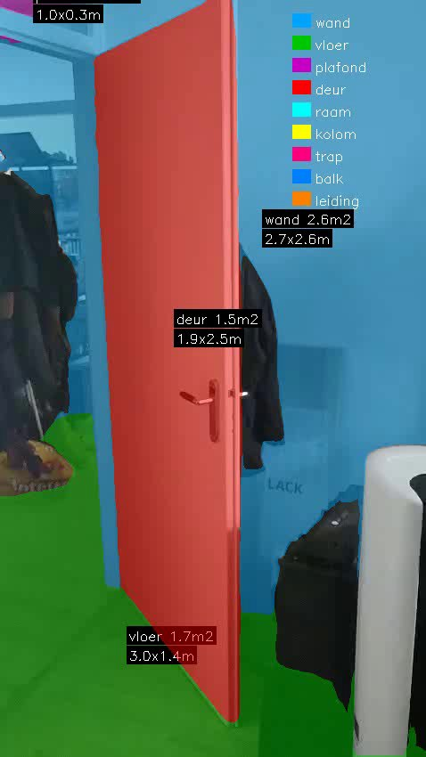

# Video to Building Analysis

Prototype voor de innovatieweek: kan je met een telefoonvideo automatisch gebouwelementen herkennen en opmeten?

## Wat doet het

Je filmt een ruimte met je telefoon → de pipeline herkent wanden, vloeren, plafonds en deuren → je krijgt afmetingen per element.

## Voorbeeld output

| |
|---|
|  |

Blauw = wand, groen = vloer, rood = deur, paars = plafond. Afmetingen worden geaggregeerd over alle frames.

[Bekijk de volledige output video](output/result_h264.mp4)

## Technieken

### Depth Anything V2 (diepteschatting)
Schat de afstand tot elk punt in beeld, puur vanuit een gewone camerafoto. Geen LiDAR of speciale hardware nodig. We gebruiken de metric-indoor variant die diepte in meters geeft.

### OneFormer (object-identificatie)
Semantic segmentation model getraind op de ADE20K dataset (150 klassen). Herkent per pixel wat het is: wand, vloer, plafond, deur, raam, etc.

### Temporal smoothing
Per pixel de meest voorkomende classificatie over een venster van 7 frames. Voorkomt dat labels per frame verspringen.

### ArUco marker (schaalcorrectie)
Diepteschatting vanuit een camera geeft geen absolute meters. Door een geprinte marker met bekende afmeting in beeld te hebben kan de pipeline automatisch de schaal berekenen.

## Pipeline

```
Telefoon video
  → Frames extracten
    → Depth Anything V2 (diepte per frame)
    → OneFormer (wand/vloer/deur/etc per pixel)
      → Temporal smoothing (stabiliseren over frames)
        → ArUco marker detectie (schaalcorrectie)
          → Geaggregeerde afmetingen per element
            → Output video met overlay
```

## Hoe gebruik je het

### 1. Installatie

```bash
git clone https://github.com/RvRooijen/video-to-building-analysis.git
cd video-to-building-analysis

python -m venv .venv
source .venv/bin/activate  # Linux/Mac
# .venv\Scripts\activate   # Windows

pip install torch torchvision --index-url https://download.pytorch.org/whl/cu124
pip install transformers opencv-python scikit-learn scipy
```

Vereist: Python 3.12+ en een NVIDIA GPU met CUDA.

### 2. Marker printen (eenmalig)

```bash
cd src
python calibration.py generate ../output/aruco_marker.png
```

Dit genereert een ArUco marker. Print deze op A4 papier. De marker wordt automatisch herkend door de pipeline — je hoeft verder niks in te stellen.

### 3. Ruimte filmen

- Plak de geprinte marker op een muur in de ruimte
- Film de ruimte met je telefoon (gewone video, ~15-30 seconden)
- Zorg dat de marker minimaal een paar seconden in beeld is
- Loop rustig rond zodat wanden, vloer en plafond in beeld komen
- Zet de video in de `input/` map

### 4. Pipeline draaien

```bash
cd src
python run.py ../input/jouw_video.mp4
```

De eerste keer duurt het langer omdat de AI-modellen gedownload worden (~1GB).

### 5. Resultaat

In de `output/` map vind je:
- `result.mp4` — de video met gekleurde overlay en afmetingen per element
  
## Zonder marker

De pipeline werkt ook zonder marker, maar dan zijn de afmetingen niet betrouwbaar. Je krijgt een melding met tip om een marker te printen.

## Vereist

- Python 3.12+
- NVIDIA GPU met CUDA
